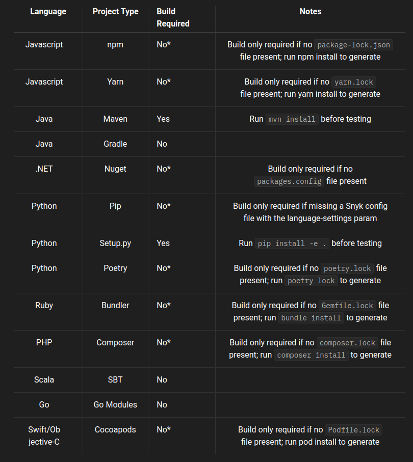
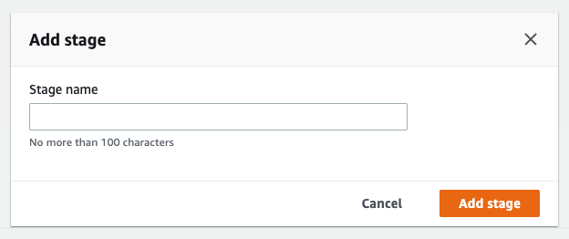
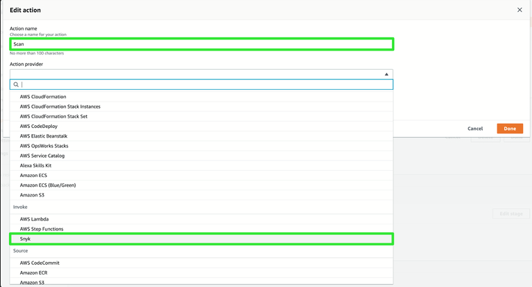
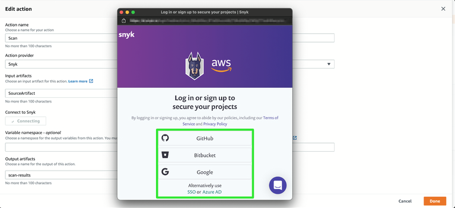
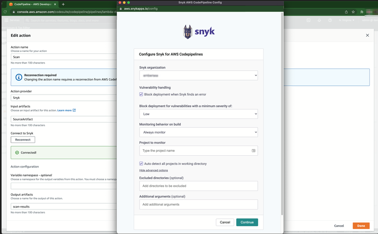

# AWS CodePipeline Security Integration Guide

This guide will help you integrate Snyk and Trivy into your AWS CodePipeline workflows to detect potential vulnerabilities in your projects.

## Introduction

Integrating security tools into your CI/CD pipelines ensures that vulnerabilities are detected early and often. We'll focus on Snyk and Trivy for AWS CodePipeline.

## Snyk Integration

All the information detailed below is available in this [official documentation](https://docs.snyk.io/integrate-with-snyk/snyk-ci-cd-integrations/aws-codepipeline-integration-by-adding-a-snyk-scan-stage).

### Language Support

- JavaScript
- Java
- .NET
- Python
- Ruby
- PHP
- Scala
- Swift/Objective-C
- Go

### Setup Requirements

Check if your project must be built before the scan in the CodePipeline. If the project needs to be built, you must add a CodeBuild step before the Snyk step.



### AWS CodePipeline CodeBuild Step Example

Example of a JavaScript CodeBuild (buildspec.yml):

```yaml
version: 0.2
phases:
  build:
    commands:
      - npm install
artifacts:
  files:
    - "**/*"
```

### Setup Steps

Warning: Snyk integration with CodePipeline requires a UI-based authentication step as part of the setup. This is not compatible with automation with non-interactive setup methods such as CloudFormation or Terraform.

1. **Add Stage**
   At any point after the Source stage, you can add a Snyk scan stage, allowing you to test your application at different stages of the CI/CD pipeline.
   Click Edit, and Add a Scan Stage.

   

2. **Add Action Group**
   Click Add an Action Group to open the Edit Action window:

   

   Name the action, then select Snyk as the Action Provider.

   Click Connect with Snyk to begin the connection process.

3. **Connect to Snyk**
   Select how you would like to authenticate with Snyk to give AWS CodePipeline permission to begin scanning your open-source code.

   

4. **Configure Settings**
   The following options are available for configuration:

   

- **Snyk Organization**: Select the Snyk organization where reports of findings are saved.
- **Vulnerability Handling**: Define the pipeline behavior if a vulnerability is found. If the "Block deployment when Snyk finds an error" checkbox is checked, the pipeline fails and does not proceed to the next stage in the CodePipeline.
- **Block Deployment for Vulnerabilities with a Minimum Severity of**: Low|Medium|High|Critical. Report only vulnerabilities of the specified level or higher.
- **Monitoring Behavior on Build**: Set the criteria to monitor projects from the AWS CodePipeline. The available options are:
  - Always monitor
  - When test fails
  - When test passes
  - Never monitor
    Unless the "Never monitor" option is selected, the "Project to monitor" field is mandatory. This is to prevent any unintentional project overrides due to naming conflicts. The report is created and associated with the selected Snyk organization.
- **Project to Monitor**: Specify the project group name for your projects. This is the same as using the remote-repo-url option in the CLI. The field does not allow any spaces in the names. This field is mandatory except when the "Never monitor" option has been selected.
- **Auto-detect All Projects in the Working Directory**: Check this checkbox to auto-detect all projects in the AWS CodePipeline. If this option is not selected, the plugin tests the first project it finds because it is using the --all-projects option to detect all projects.

Lastly, confirm the connection to Snyk when prompted.

## Trivy Integration

### Examples

To integrate Trivy with your AWS CodePipeline:

```yaml
version: 0.2
phases:
  install:
    runtime-versions:
      docker: latest
  build:
    commands:
      - docker pull aquasec/trivy:latest
      - docker run --rm -v $(pwd):/root/src aquasec/trivy:latest fs /root/src --exit-code 1 --severity HIGH,CRITICAL --no-progress
artifacts:
  files:
    - "**/*"
```

### Advanced Example with SARIF Upload

To upload Trivy scan results to the AWS CodePipeline security dashboard:

```yaml
version: 0.2
phases:
  install:
    runtime-versions:
      docker: latest
  build:
    commands:
      - docker pull aquasec/trivy:latest
      - docker run --rm -v $(pwd):/root/src aquasec/trivy:latest fs /root/src --exit-code 1 --severity HIGH,CRITICAL --no-progress --format sarif --output trivy-results.sarif
artifacts:
  files:
    - "**/*"
    - trivy-results.sarif
reports:
  name: TrivyScan
  files:
    - trivy-results.sarif
```

## Best Practices

1. **Least Privilege Principle**: Grant the minimal permissions required for the tools to operate.
2. **Regular Updates**: Keep your tools and dependencies up to date to benefit from the latest security patches and features.
3. **Fail Fast**: Configure your workflows to fail the build upon detecting critical vulnerabilities.
4. **Monitor and Alert**: Set up alerts for new vulnerabilities and monitor your dashboards regularly.

By following these guidelines and using the provided examples, you'll maintain a secure and robust CI/CD pipeline. Happy coding! 🚀
