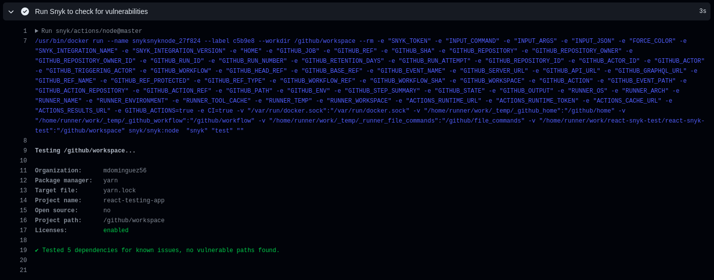
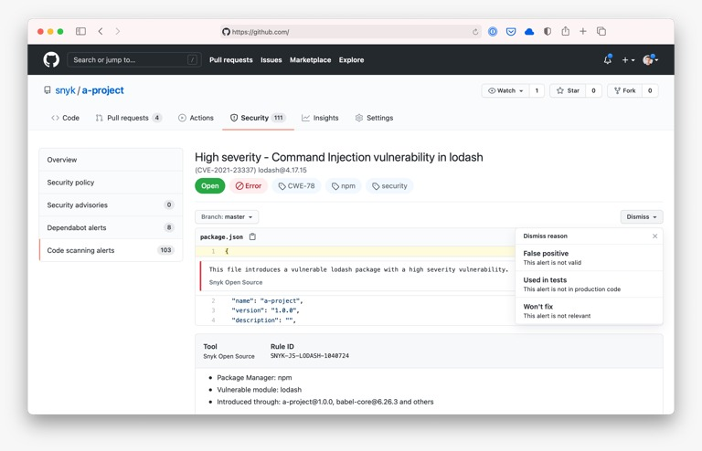
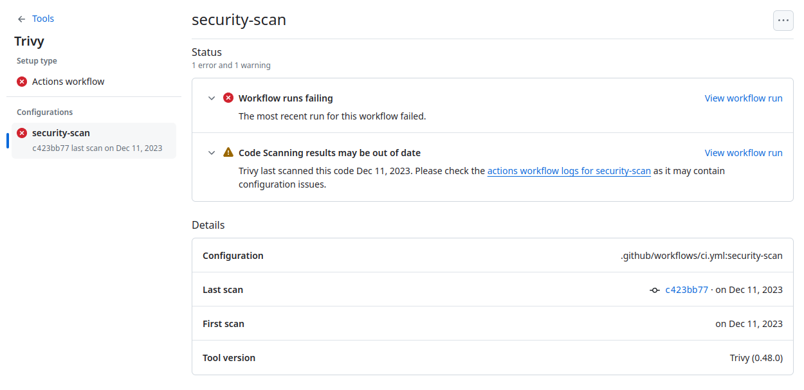

# 🌟 GitHub Actions Security Integration Guide 🌟

This guide is designed to help you integrate powerful security tools like Snyk, Trivy, and Super Linter into your GitHub Actions workflows. We'll cover how to set up these tools for push events, pull request validations, scheduled checks, and more, ensuring your code stays secure and compliant.

## Introduction

GitHub Actions provides a powerful way to automate your CI/CD pipelines. Integrating security tools into these workflows ensures that vulnerabilities are detected early and often. We'll be focusing on three main tools: Snyk, Trivy, and Super Linter. Each of these tools has unique strengths and can be integrated into various stages of your workflow.

## Snyk Integration

### What is Snyk?

🔒 **Snyk** helps developers find and fix vulnerabilities in their dependencies, container images, and Kubernetes applications. It continuously monitors your projects and alerts you about newly disclosed vulnerabilities.

### Prerequisites

To use these actions, the first step is to obtain our `SNYK_TOKEN`. For this purpose, consider the following:

Every Snyk account has this token. Once you create an account ([Snyk Account Creation](https://app.snyk.io/login?utm_medium=Partner&utm_source=GitHub&utm_term=Actions-Marketplace&utm_content=signup)), you can find it in one of two ways:

1. In the Snyk UI, go to your Snyk account's settings page ([Snyk Account Settings](https://app.snyk.io/account)) and retrieve the API token, as shown in the following [Revoking and Regenerating Snyk API Tokens](https://support.snyk.io/hc/en-us/articles/360004008278-Revoking-and-regenerating-Snyk-API-tokens).

2. If you're using the Snyk CLI ([Snyk CLI Documentation](https://docs.snyk.io/snyk-cli/getting-started-with-the-cli)) locally, you can retrieve it by running `snyk config get api`.

### Basic Example on Push Event

Once we have our SNYK_TOKEN, we can start using the actions. Here is a basic example of how to run Snyk on every push:

```yaml
name: Snyk Security Check

on: push

jobs:
  snyk:
    runs-on: ubuntu-latest
    permissions:
      contents: read
    steps:
      - name: Checkout code
        uses: actions/checkout@v4
      - name: Run Snyk to check for vulnerabilities
        uses: snyk/actions/node@master
        env:
          SNYK_TOKEN: ${{ secrets.SNYK_TOKEN }}
```




Note that this example was executed, if you want to send the results to Snyk, you can use the `monitor` command as follows:

```yaml
name: Snyk Security Check

on: push

jobs:
  snyk:
    runs-on: ubuntu-latest
    permissions:
      contents: read
    steps:
      - name: Checkout code
        uses: actions/checkout@v4
      - name: Run Snyk to check for vulnerabilities
        uses: snyk/actions/node@master
        env:
          SNYK_TOKEN: ${{ secrets.SNYK_TOKEN }}
        with:
          command: monitor
```

### Example of Blocking PRs with Vulnerabilities

To block PRs with vulnerabilities and report findings:

```yaml
name: Snyk PR Validation

on: pull_request

jobs:
  snyk:
    runs-on: ubuntu-latest
    permissions:
      contents: read
    steps:
      - name: Checkout code
        uses: actions/checkout@v4
      - name: Run Snyk to check for vulnerabilities
        uses: snyk/actions/node@master
        env:
          SNYK_TOKEN: ${{ secrets.SNYK_TOKEN }}
        with:
          args: --fail-on=all
```

### Scheduled Check Example

Since Snyk is a tool that continuously monitors your projects, it's a good idea to run it on a schedule. Here is an example of how to run Snyk daily at 2 AM:

```yaml
name: Scheduled Snyk Check

on:
  schedule:
    - cron: '0 2 * * *' # Runs daily at 2 AM
    UTC

jobs:
  snyk:
    runs-on: ubuntu-latest
    permissions:
      contents: read
      security-events: write
    steps:
      - name: Checkout code
        uses: actions/checkout@v4
      - name: Run Snyk to check for vulnerabilities
        uses: snyk/actions/node@master
        env:
          SNYK_TOKEN: ${{ secrets.SNYK_TOKEN }}
```

### Example of Reporting Only on High Severity Vulnerabilities

By using the `args` property of the action you can use all of the options and capabilities of the [Snyk CLI](https://docs.snyk.io/snyk-cli/cli-reference). This example shows use of the option `--severity-threshold=high`.

```yaml
name: Example workflow using Snyk

on: push

jobs:
  security:
    runs-on: ubuntu-latest
    steps:
      - uses: actions/checkout@4
      - name: Run Snyk to check for vulnerabilities
        uses: snyk/actions/node@master
        env:
          SNYK_TOKEN: ${{ secrets.SNYK_TOKEN }}
        with:
          args: --severity-threshold=high
```

### Use Your Own Development Environment

The Snyk GitHub Actions for each language automatically install all the required development tools for Snyk to determine the correct dependencies and hence vulnerabilities from different language environments. If you have a workflow where you already have the development tools installed, you can instead use the `snyk/actions/setup` Action to install only Snyk CLI. An example follows:

```yaml
name: Snyk example

on: push

jobs:
  security:
    runs-on: ubuntu-latest
    steps:
      - uses: actions/checkout@4
      - uses: snyk/actions/setup@master
      - uses: actions/setup-go@v5
        with:
          go-version: "1.19"
      - name: Snyk test
        run: snyk test
        env:
          SNYK_TOKEN: ${{ secrets.SNYK_TOKEN }}
```

### Continuing on Error

The above examples will fail the workflow when issues are found. If you want to ensure the Action continues, even if Snyk finds vulnerabilities, then [continue-on-error](https://docs.github.com/en/actions/using-workflows/workflow-syntax-for-github-actions#jobsjob_idstepscontinue-on-error) can be used.

```yaml
name: Example workflow using Snyk with continue on error

on: push

jobs:
  security:
    runs-on: ubuntu-latest
    steps:
      - uses: actions/checkout@4
      - name: Run Snyk to check for vulnerabilities
        uses: snyk/actions/node@master
        continue-on-error: true
        env:
          SNYK_TOKEN: ${{ secrets.SNYK_TOKEN }}
```

### Upload Scan Results to GitHub Security Tab

> To use this option for private repos you must have GitHub Advanced Security.
> If you see the error `Advanced Security must be enabled for this repository to use code scanning`, check that GitHub Advanced Security is enabled. For more information, see "Managing security and analysis settings for your repository."

Snyk GitHub Actions support integration with GitHub Code Scanning to show vulnerability information on the GitHub Security tab. The following applies to Snyk GitHub Actions for Open Source languages and package managers. For information on specific languages, package managers, and processes see the pages listed in ([GitHub Actions for Open Source languages and package managers](https://docs.snyk.io/integrations/ci-cd-integrations/github-actions-integration#github-actions-for-open-source-languages-and-package-managers)) and ([GitHub Actions for Snyk Container and Snyk Infrastructure as Code](https://docs.snyk.io/integrations/ci-cd-integrations/github-actions-integration#github-actions-for-snyk-container-and-snyk-infrastructure-as-code)).

Using `--sarif-file-output` ([Snyk CLI option](https://docs.snyk.io/snyk-cli/cli-reference)) and the ([GitHub SARIF upload action](https://docs.github.com/en/code-security/secure-coding/uploading-a-sarif-file-to-github)), you can upload Snyk scan results to the GitHub Code Scanning as shown in the example that follows.

The Snyk Action fails when vulnerabilities are found. This would prevent the SARIF upload action from running. Thus you must use a continue-on-error option as shown in the example that follows:

```yaml
name: Example workflow using Snyk

on: push

jobs:
  security:
    runs-on: ubuntu-latest
    steps:
      - uses: actions/checkout@4
      - name: Run Snyk to check for vulnerabilities
        uses: snyk/actions/node@master
        continue-on-error: true # To make sure that SARIF upload gets called
        env:
          SNYK_TOKEN: ${{ secrets.SNYK_TOKEN }}
        with:
          args: --sarif-file-output=snyk.sarif
      - name: Upload result to GitHub Code Scanning
        uses: github/codeql-action/upload-sarif@v2
        with:
          sarif_file: snyk.sarif
```

The following image shows the results of the Snyk scan uploaded to the GitHub Security tab.



## Trivy Integration

### What is Trivy?

🔍 **Trivy** is a comprehensive and easy-to-use open-source vulnerability scanner for container images, file systems, and Git repositories. It detects vulnerabilities in OS packages and application dependencies.

### Prerequisites

To use Trivy actions, you will need your GitHub repository set up with a GitHub Actions workflow file.

### Push Event

To run Trivy on every push:

```yaml
name: Trivy Security Check

on: push

jobs:
  trivy:
    runs-on: ubuntu-latest
    permissions:
      contents: read
    steps:
      - name: Checkout code
        uses: actions/checkout@v4
      - name: Run Trivy vulnerability scanner
        uses: aquasecurity/trivy-action@master
        with:
          scan-type: "fs"
          scan-ref: "."
          severity: "CRITICAL,HIGH"
          ignore-unfixed: true
          format: "table"
```

### Pull Request Validation

To block PRs with vulnerabilities and report findings:

```yaml
name: Trivy PR Validation

on: pull_request

jobs:
  trivy:
    runs-on: ubuntu-latest
    permissions:
      contents: read
    steps:
      - name: Checkout code
        uses: actions/checkout@v4
      - name: Run Trivy vulnerability scanner
        uses: aquasecurity/trivy-action@master
        with:
          scan-type: "fs"
          scan-ref: "."
          severity: "CRITICAL,HIGH"
          ignore-unfixed: true
          format: "table"
```

### Scheduled Check

To run Trivy on a schedule:

```yaml
name: Scheduled Trivy Check

on:
  schedule:
    - cron: '0 2 * * *' # Runs daily at 2 AM
    UTC

jobs:
  trivy:
    runs-on: ubuntu-latest
    permissions:
      contents: read
    steps:
      - name: Checkout code
        uses: actions/checkout@v4
      - name: Run Trivy vulnerability scanner
        uses: aquasecurity/trivy-action@master
        with:
          scan-type: 'fs'
          scan-ref: '.'
          severity: 'CRITICAL,HIGH'
          ignore-unfixed: true
          format: 'table'
```

### Upload Scan Results to GitHub Security Tab

To upload Trivy scan results to the GitHub Security tab:

```yaml
name: Trivy Security Scan with Upload
on:
  push:
  schedule:
    - cron: "31 1,12 * * *"

permissions:
  contents: read

jobs:
  security-scan:
    runs-on: ubuntu-22.04
    timeout-minutes: 5

    permissions:
      security-events: write
      actions: read
      contents: read

    steps:
      - name: Checkout code
        uses: actions/checkout@v4

      - name: Run Trivy vulnerability scanner
        uses: aquasecurity/trivy-action@0.23.0
        env:
          TRIVY_USERNAME: ${{ github.repository_owner }}
          TRIVY_PASSWORD: ${{ github.token }}
        with:
          scan-type: "fs"
          scan-path: "."
          ignore-unfixed: true
          severity: "CRITICAL,HIGH"
          format: "sarif"
          output: "trivy-results.sarif"

      - name: Upload Trivy scan results to GitHub Security tab
        uses: github/codeql-action/upload-sarif@v3.25.11
        with:
          sarif_file: "trivy-results.sarif"
```

The following image shows the results of the Snyk scan uploaded to the GitHub Security tab.



## Super Linter Integration

### What is Super Linter?

🛠️ **Super Linter** is a combination of various linters to prevent broken code from being pushed to repositories. It includes tools like Checkov for security analysis of Infrastructure as Code. It is highly configurable, allowing customization for different languages and standards.

### Push Event

To run Super Linter on every push:

```yaml
name: Super Linter Check

on: push

jobs:
  linter:
    runs-on: ubuntu-latest
    permissions:
      contents: read
      pull-requests: write
      statuses: write
    steps:
      - name: Checkout code
        uses: actions/checkout@v4
      - name: Run Super Linter
        uses: github/super-linter@v3
        env:
          VALIDATE_ALL_CODEBASE: false
          DEFAULT_BRANCH: main
```

### Pull Request Validation

To block PRs with linting errors and report findings:

```yaml
name: Super Linter PR Validation

on: pull_request

jobs:
  linter:
    runs-on: ubuntu-latest
    permissions:
      contents: read
      pull-requests: write
      statuses: write
    steps:
      - name: Checkout code
        uses: actions/checkout@v4
      - name: Run Super Linter
        uses: github/super-linter@v3
        env:
          VALIDATE_ALL_CODEBASE: false
          DEFAULT_BRANCH: main
          GITHUB_TOKEN: ${{ secrets.GITHUB_TOKEN }}
```

the PR validation example above will fail the PR if there are any errors found by the linter.
It will show different statuses for each linter in the PR checks tab.


### Scheduled Check

To run Super Linter on a schedule:

```yaml
name: Scheduled Linter Check

on:
  schedule:
    - cron: '0 2 * * *' # Runs daily at 2 AM
    UTC

jobs:
  linter:
    runs-on: ubuntu-latest
    permissions:
      contents: read
      pull-requests: write
      statuses: write
    steps:
      - name: Checkout code
        uses: actions/checkout@v4
      - name: Run Super Linter
        uses: github/super-linter@v3
        env:
          VALIDATE_ALL_CODEBASE: false
          DEFAULT_BRANCH: main
```

### Highly Configurable Example

Super Linter is highly configurable. Here is an example with additional configurations for a Python project:

```yaml
name: Super Linter

on:
  push:
    branches:
      - main
  pull_request:
    branches:
      - main

permissions:
  contents: read

jobs:
  build:
    name: Lint Code Base
    runs-on: ubuntu-latest
    permissions:
      contents: read
      pull-requests: write
      actions: read
      checks: read
      statuses: write
    steps:
      - name: Checkout
        id: checkout
        uses: actions/checkout@v4
        with:
          fetch-depth: 0

      - name: Set up Python, including cache for pipenv virtual environment
        uses: actions/setup-python@v5
        with:
          python-version-file: .python-version
          cache: pipenv

      - name: Install pipenv
        run: |
          pip install --upgrade pip
          pip install pipenv

      - name: Install project dependencies
        run: pipenv install --deploy --dev

      - name: Get virtual environment path
        id: get-venv-path
        run: echo "venv-path=$(pipenv --venv)" >> "$GITHUB_OUTPUT"

      - name: Copy python dependencies
        run: cp -r "${{ steps.get-venv-path.outputs.venv-path }}" /home/runner/work/_temp/_github_workflow/.venv

      - name: Get Python version from .python-version file
        id: get-python-version
        run: echo "python-version=$(cut -d '.' -f 1,2 .python-version)" >> "$GITHUB_OUTPUT"

      - name: Lint Code Base
        uses: super-linter/super-linter/slim@v6
        env:
          GITHUB_TOKEN: ${{ secrets.GITHUB_TOKEN }}
          DEFAULT_BRANCH: main
          VALIDATE_ALL_CODEBASE: false
          LINTER_RULES_PATH: .
          PYTHONPATH: "/github/workspace:/github/workflow/.venv/lib/python${{ steps.get-python-version.outputs.python-version }}/site-packages"
          MARKDOWN_CONFIG_FILE: .markdownlint.json
          PYTHON_BLACK_CONFIG_FILE: pyproject.toml
          PYTHON_ISORT_CONFIG_FILE: pyproject.toml
          PYTHON_MYPY_CONFIG_FILE: pyproject.toml
          PYTHON_PYLINT_CONFIG_FILE: pyproject.toml
          PYTHON_RUFF_CONFIG_FILE: pyproject.toml
```

## Additional Tools

Here are some additional tools you might consider integrating into your GitHub Actions workflows for enhanced security:

- **Bandit**: A security linter for Python.
- **Checkmarx**: Comprehensive static and dynamic application security testing.
- **OWASP ZAP**: A tool for finding vulnerabilities in web applications.

## Best Practices

1. **Least Privilege Principle**: Grant the minimal permissions required for the tools to operate.
2. **Regular Updates**: Keep your tools and dependencies up to date to benefit from the latest security patches and features.
3. **Fail Fast**: Configure your workflows to fail the build upon detecting critical vulnerabilities.
4. **Monitor and Alert**: Set up alerts for new vulnerabilities and monitor your dashboards regularly.

By following these guidelines and using the provided examples, you'll be able to maintain a secure and robust CI/CD pipeline. Happy coding! 🚀

**References:**

- [Snyk GitHub Actions Documentation](https://docs.snyk.io/integrate-with-snyk/ci-cd-integrations/github-actions-integration)
- [Trivy GitHub Actions](https://github.com/aquasecurity/trivy-action)
- [Super Linter GitHub](https://github.com/github/super-linter)
