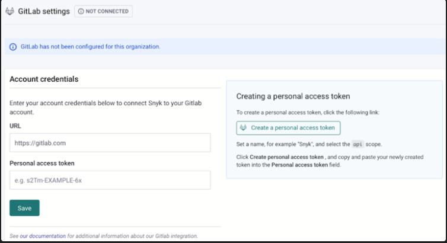

# GitLab CI Security Integration Guide

This guide will help you integrate Snyk, Trivy, and Super Linter into your GitLab workflows to detect potential vulnerabilities in your projects.

## Introduction

Integrating security tools into your CI/CD pipelines ensures that vulnerabilities are detected early and often. We'll focus on Snyk, Trivy, and Super Linter, each with unique strengths.

## Snyk Integration

All the information detailed below is based on this [official documentation](https://docs.snyk.io/integrate-with-snyk/git-repositories-scms-integrations-with-snyk/snyk-gitlab-integration).

### Prerequisites

1. GitLab version 9.5 and above (API v4).
2. A public or private GitLab group or project.
3. A GitLab access token for integration with Snyk.

### Setup

Add a GitLab Personal Access Token in GitLab:

1. Generate a GitLab Personal Access Token in a GitLab instance.
   Select the profile icon, then Edit Profile > Access Tokens.
   Set the token name, for example, Snyk, and select the api scope.

   

2. Navigate to the Snyk [Integrations](https://app.snyk.io/integrations) page, select the GitLab integration tile, and enter your GitLab instance URL and token.

   

3. Click Save.

4. When the tile on the Integrations page indicates the integration is Configured, click the tile and select the GitLab projects to test or select Add projects from the Snyk Dashboard.

### Uses

The Snyk GitLab integration allows you to:

1. Check for vulnerabilities in your pull requests.
2. Trigger a Snyk pull request for the fixes listed from the Report page or the Project page on the Snyk Web UI.
3. Receive email alerts when new vulnerabilities that affect your repository arise and fixes for those vulnerabilities are shown.
4. Receive email alerts containing a new pull request if a new upgrade or patch is available for a vulnerability.

### Fixing Vulnerabilities

Generate Snyk merge requests to fix detected vulnerabilities:

- **Fix these vulnerabilities**: generate a merge request with the minimal changes needed to fix all the Snyk Project's detected vulnerabilities.
- **Fix this vulnerability**: generate a merge request on an individual issue that fixes the vulnerability.

### Email Alerts

Receive email alerts when new vulnerabilities are detected on a Snyk Project you are watching, and Snyk will generate a merge request to address them.

## Trivy Integration

All the information detailed below is based on this [official documentation](https://aquasecurity.github.io/trivy/v0.53/tutorials/integrations/gitlab-ci/).

### Examples

To integrate Trivy with your GitLab CI/CD pipeline:

```yaml
stages:
  - security

trivy-scan:
  image: aquasec/trivy:latest
  stage: security
  script:
    - trivy fs --exit-code 1 --severity HIGH,CRITICAL --no-progress .
  only:
    - merge_requests
```

### Advanced Example with SARIF Upload

To upload Trivy scan results to the GitLab security dashboard:

```yaml
stages:
  - security

trivy-scan:
  image: aquasec/trivy:latest
  stage: security
  script:
    - trivy fs --exit-code 1 --severity HIGH,CRITICAL --no-progress --format sarif --output trivy-results.sarif .
  artifacts:
    reports:
      sast: trivy-results.sarif
  only:
    - merge_requests
```

## Super Linter Integration

All the information detailed below is based on this [official snippet](https://gitlab.com/-/snippets/1988376).

### Examples

To integrate Super Linter with your GitLab CI/CD pipeline:

```yaml
stages:
  - lint

superlinter:
  stage: lint
  image: github/super-linter:latest
  script: ["true"]
  variables:
    RUN_LOCAL: "true"
    DEFAULT_WORKSPACE: $CI_PROJECT_DIR
    ANSIBLE_DIRECTORY: $CI_PROJECT_PATH
    LINTER_RULES_PATH: $CI_PROJECT_PATH/.github/linters
  only:
    - merge_requests
```

## Mega Linter Integration

Mega Linter is another powerful linter tool that can be used for more capabilities and better performance. It includes various linters and supports more languages and frameworks.

### Examples

To integrate Mega Linter with your GitLab CI/CD pipeline:

```yaml
stages:
  - test

mega-linter:
  stage: test
  image: nvuillam/mega-linter-python:v4
  script: ["true"]
  variables:
    DEFAULT_WORKSPACE: $CI_PROJECT_DIR
    DEFAULT_BRANCH: master
  artifacts:
    when: always
    paths:
      - report
    expire_in: 1 week
  only:
    - merge_requests
```

## Best Practices

1. **Least Privilege Principle**: Grant the minimal permissions required for the tools to operate.
2. **Regular Updates**: Keep your tools and dependencies up to date to benefit from the latest security patches and features.
3. **Fail Fast**: Configure your workflows to fail the build upon detecting critical vulnerabilities.
4. **Monitor and Alert**: Set up alerts for new vulnerabilities and monitor your dashboards regularly.

By following these guidelines and using the provided examples, you'll maintain a secure and robust CI/CD pipeline. Happy coding! 🚀
